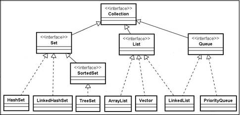

## Collections
Framework com Interfaces e classes para tratar grupos de dados como uma única unidade, chamada **collection**.

---
## Hierarquia de interfaces e classes
Interfaces e classes do Collections Framework

Linhas cheias representam extends e linhas pontilhadas representam implements.


- **List** → ordenada, permite repetição
- **Set** → não permite duplicados
- **Queue** → fila (ordem de processamento)

**Não** garantem ordem
**Não** têm índixe
**Podem ou não** permitir itens duplicados (varia de cada um)

---

## Métodos principais
- **add(E e)** → adiciona
- **remove(Object o)** → remove
- **size()** → quantidade
- **isEmpty()** → vazia ou não
- **contains(Object o)** → verifica elemento
- **clear()** → limpa tudo
- **iterator()** → percorre elementos

---

## Formas de percorrer

- **for-each**
- **Iterator**

```java
// For-each
public class ExemploForeach {
    public static void main(String[] args) {
        Collection<String> nomes = new ArrayList<>();

        nomes.add("Ana");
        nomes.add("João");

        for (String nome : nomes) {
            System.out.println(nome);
        }
    }
}

// Iterator
public class ExemploIterator {
    public static void main(String[] args) {
        Collection<String> nomes = new ArrayList<>();

        nomes.add("Ana");
        nomes.add("João");

        Iterator<String> it = nomes.iterator();

        while (it.hasNext()) {
            System.out.println(it.next());
        }
    }
}
```

---

## Exemplos

```java
// ArrayList
public class Exemplo1 {
    public static void main(String[] args) {
        Collection<String> nomes = new ArrayList<>();

        nomes.add("Ana");
        nomes.add("João");
        nomes.add("Maria");

        System.out.println(nomes); // [Ana, João, Maria]
    }
}
```

```java
// Verificando elementos
public class Exemplo2 {
    public static void main(String[] args) {
        Collection<Integer> numeros = new ArrayList<>();

        numeros.add(10);
        numeros.add(20);

        System.out.println(numeros.contains(10)); // true
        System.out.println(numeros.size());       // 2
    }
}
```

```java
// Removendo elementos
public class Exemplo3 {
    public static void main(String[] args) {
        Collection<String> nomes = new ArrayList<>();

        nomes.add("Ana");
        nomes.add("Carlos");

        nomes.remove("Ana");

        System.out.println(nomes); // [Carlos]
    }
}
```

```java
// Limpando coleção
public class Exemplo4 {
    public static void main(String[] args) {
        Collection<String> nomes = new ArrayList<>();

        nomes.add("Ana");
        nomes.add("João");

        nomes.clear();

        System.out.println(nomes.isEmpty()); // true
    }
}
```