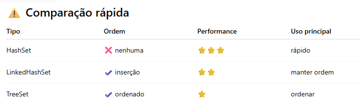

## Set
Contrato para coleções de elementos únicos sem índice.

- **Não aceita duplicatas**: Se tentar adicionar algo que já existe, o método add() simplesmente retorna false.
- **Não existe índice**. Para pegar um elemento, ou você itera (for-each/Stream) ou verifica se ele existe com contains().
- **Pode ou não** Manter ordem de inserção

#### Métodos importantes
- **add(E e)** → adiciona elemento (não permite duplicados)
- **remove(Object o)** → remove elemento
- **contains(Object o)** → verifica se existe
- **size()** → quantidade de elementos
- **isEmpty()** → verifica se está vazio
- **clear()** → remove todos os elementos
- **addAll(Collection c)** → adiciona vários elementos
- **removeAll(Collection c)** → remove vários elementos
- **retainAll(Collection c)** → mantém apenas os elementos em comum

---

## HashSet

#### Características
A implementação padrão. Usa uma Tabela Hash por baixo dos panos.
**Performance**: É a mais rápida. Busca e inserção são $O(1)$ (tempo constante).
**Ordem**: Caótica. Não confie na ordem dos elementos; ela pode mudar até quando você adiciona novos itens.
**Uso**: Quando você só quer saber se o item está lá e quer o máximo de velocidade.

#### Exemplo HashSet:
```java
public class HashSetExemplo {
    public static void main(String[] args) {
        Set<String> nomes = new HashSet<>();

        nomes.add("Carlos");
        nomes.add("Ana");
        nomes.add("Bruno");
        nomes.add("Ana"); // duplicado

        System.out.println(nomes);
        // saída pode ser: [Bruno, Ana, Carlos] (ordem aleatória)
    }
}
```

---

## LinkedHashSet

#### Características
Um HashSet que "anota" a ordem de chegada.
**Performance**: Quase tão rápido quanto o HashSet ($O(1)$), mas consome um pouco mais de memória para manter as referências da lista ligada.
**Ordem**: Mantém a ordem de inserção. Se você inseriu A, B e C, ele vai iterar A, B e C.
**Uso**: Quando você quer unicidade, mas precisa manter a sequência original.

#### Exemplo LinkedHashSet:
```java
public class LinkedHashSetExemplo {
    public static void main(String[] args) {
        Set<String> nomes = new LinkedHashSet<>();

        nomes.add("Carlos");
        nomes.add("Ana");
        nomes.add("Bruno");

        System.out.println(nomes);
        // saída: [Carlos, Ana, Bruno]
    }
}
```

---

## TreeSet

#### Características
Armazena os dados em uma Árvore Rubro-Negra.
**Performance**: Mais lento ($O(\log n)$), pois precisa reequilibrar a árvore a cada inserção.
**Ordem**: Natural (alfabética, numérica) ou via um Comparator personalizado.
**Requisito**: O objeto tem que implementar Comparable, senão o código estoura um ClassCastException na hora de comparar os nós da árvore.
**Uso**: Quando você precisa que o conjunto esteja sempre ordenado.

#### Exemplo TreeSet:
```java
public class TreeSetExemplo {
    public static void main(String[] args) {
        Set<Integer> numeros = new TreeSet<>();

        numeros.add(50);
        numeros.add(10);
        numeros.add(30);

        System.out.println(numeros);
        // saída: [10, 30, 50]
    }
}
```

---

#### Importante

Para objetos personalizados funcionarem corretamente no Set, você precisa sobrescrever os métodos equals() e hashCode():
- **hashCode()**: O Java gera um número (hash) para saber em qual "balde" colocar o objeto.
- **equals()**: Se dois objetos caírem no mesmo balde (colisão), o Java usa o equals para ter certeza se são idênticos.

**Regra**: Se dois objetos são iguais pelo equals(), eles obrigatoriamente devem ter o mesmo hashCode(). Se você quebrar essa regra, terá duplicatas no seu Set.

```java
class Pessoa {
    String nome;

    Pessoa(String nome) {
        this.nome = nome;
    }

    @Override
    public boolean equals(Object o) {
        if (this == o) return true;
        if (!(o instanceof Pessoa)) return false;
        Pessoa p = (Pessoa) o;
        return nome.equals(p.nome);
    }

    @Override
    public int hashCode() {
        return nome.hashCode();
    }
}
```
---

