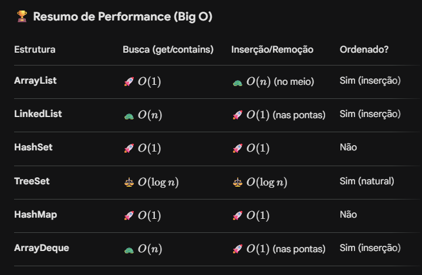

## Fluxograma de Decisão: Qual Collection usar?

Para escolher a estrutura certa, faça estas perguntas nesta ordem:

#### 1. Preciso guardar pares de Chave → Valor?
- SIM: Use Map.
    - Preciso de velocidade máxima? → HashMap
    - A ordem de inserção importa? → LinkedHashMap
    - Tem que estar sempre em ordem alfabética/numérica? → TreeMap

#### 2. Preciso de elementos repetidos ou acesso por índice (posição)?
- SIM: Use List.
    - Vou apenas ler dados e adicionar no fim? → ArrayList (Padrão)
    - Vou inserir/remover muito no início da lista? → LinkedList

#### 3. Preciso garantir que NÃO haja duplicatas?
- SIM: Use Set.
    - Só quero que seja único e rápido? → HashSet
    - Quero único + ordem de inserção? → LinkedHashSet
    - Quero único + ordem natural (A-Z)? → TreeSet

#### 4. Preciso de uma Fila ou Pilha?
- SIM: Use Queue ou Deque.
    - Fila padrão (quem chega primeiro sai primeiro)? → ArrayDeque
    - Pilha (o último que entra sai primeiro)? → ArrayDeque (usando push/pop)
    - Fila onde o "menor" ou "mais importante" sai primeiro? → PriorityQueue

---

## Dica de Código Clean
Sempre declare pelo Tipo da Interface e instancie pela Implementação. Isso permite que você mude a estrutura depois sem quebrar o resto do código:

```java
// DO JEITO CERTO (Flexível)
List<String> nomes = new ArrayList<>(); 
Map<Integer, String> usuarios = new HashMap<>();

// EVITE (Engessado)
ArrayList<String> nomes = new ArrayList<>();
```

---

##  Resumo performance

