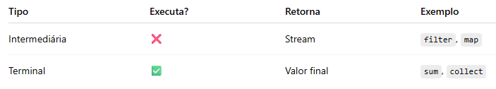
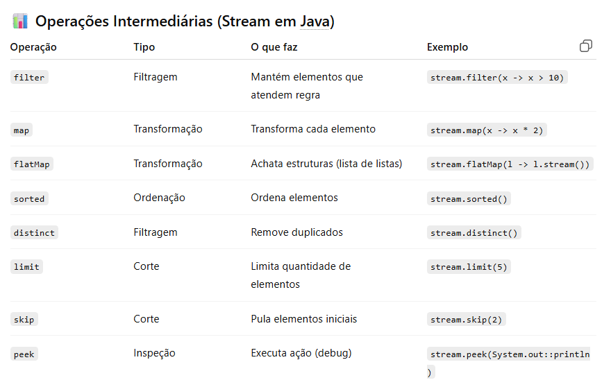
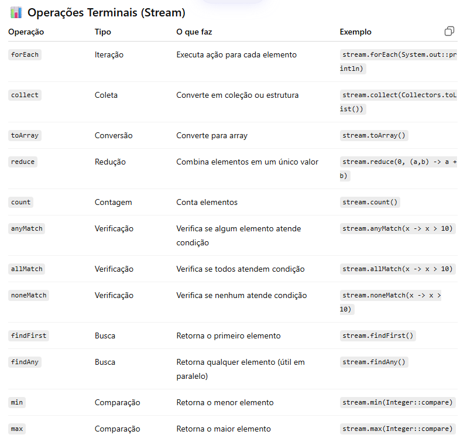

## Stream
Esteira de fábrica que processa os elementos de uma coleção

- **Não alteram a fonte**: Criam uma versão processada
- **Lazy evaluation**: Só processam os dados quando você pede o resultado final

---

## Pipeline 
Toda Stream funciona em 3 etapas:
- **Fonte**: De onde vêm os dados (lista.stream()).
- **Operações Intermediárias**: Filtros e transformações (retornam uma nova Stream).
- **Operação Terminal**: Fecha a conta e entrega o resultado (retorna uma lista, um número ou nada).



---

## Operações Intermediárias
- ⚙️ Lazy (execução sob demanda)
- 🔗 Encadeáveis
- 🔄 Retornam outro Stream
- 🚫 Não finalizam o processamento



---

## Operações Terminais
- 🛑 Encerram o Stream
- ▶️ Disparam a execução
- 🔚 Retornam valor final (ou void)



---

## Exemplos

#### Nomes que começam com A
```java
import java.util.Arrays;
import java.util.List;
import java.util.stream.Collectors;

public class ExemploStream {
    public static void main(String[] args) {
        List<String> nomes = Arrays.asList("Ana", "Bruno", "Carlos", "Amanda", "Beatriz");

        List<String> resultado = nomes.stream()
                .filter(nome -> nome.startsWith("A")) // filtra nomes que começam com A
                .map(String::toUpperCase)             // transforma para maiúsculo
                .sorted()                             // ordena
                .collect(Collectors.toList());        // Operação terminal que joga tudo dentro de resultado[]

        System.out.println(resultado);
        // Saída: [AMANDA, ANA]
    }
}
```

#### Soma dos dobros dos números pares
```java
public class ExemploNumeros {
    public static void main(String[] args) {
        List<Integer> numeros = Arrays.asList(1, 2, 3, 4, 5, 6);

        int soma = numeros.stream()
                .filter(n -> n % 2 == 0) // só pares
                .mapToInt(n -> n * 2)    // dobra os valores
                .sum();                  // soma tudo

        System.out.println(soma);
        // Saída: 24
    }
}
```